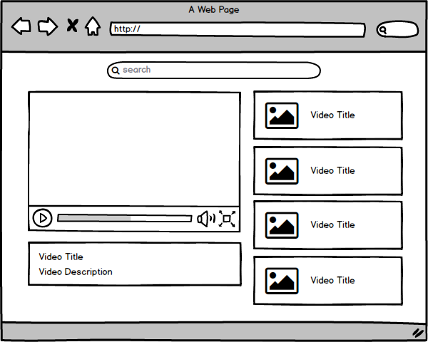
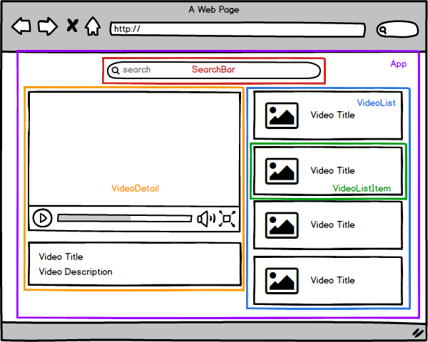

# React Tube

Repositori untuk belajar [react.js](https://facebook.github.io/react/) dengan meniru tampilan [youtube](https://www.youtube.com/).

## Persiapan

Duplikasi repositori ini dan install dependensi modul ini dengan perintah berikut,

```
$ git clone git@github.com:berkedel/react-tube.git
$ cd react-tube
$ npm install
$ npm start
```

## Mockup

Kira-kira tampilan [react-tube](https://github.com/berkedel/react-tube) yang akan kita bikin bisa kita sketsa sebagai berikut,



Di sini kita akan membaginya ke dalam beberap komponen react:

* **SearchBar**
Menerima input kata kunci video yang akan dicari.
* **VideoDetail**
Video player beserta judul dan deskripsi video yang sedang dimainkan.
* **VideoListItem**
Preview video berupa thumbnail dan judul.
* **VideoList**
Daftar preview video yang didapatkan dari hasil pencarian. Komponen ini mempunyai beberapa komponen *VideoListItem*
* **App**
Komponen yang menggabungkan semua komponen sebelumnya.



